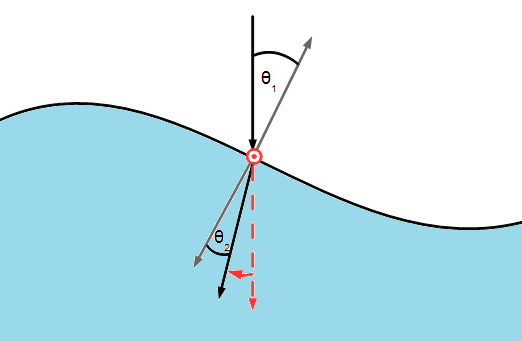

Caustics and Dispersion
============================

Caustics
^^^^^^^^

A caustic is the envelope of light rays reflected or refracted by a curved surface or object, or the projection of that envelope of rays on another surface. An example of this is the light seen at the bottom of a swimming pool. If the second media has a larger refractive index then raised regions will focus the light as the entering light is bent towards the surface normal.

Using the method described in the Ray Object page_ , caustics can be simulated for a simple two media system.

.. _page: http://pycav.readthedocs.io/en/latest/api/optics/ray_object.html

An example of its use can be found here_.

.. _here: http://nbviewer.jupyter.org/github/PyCav/Demos/blob/master/Optics/Caustics.ipynb

The functions described below allow for easy use of the Ray Object to produce caustic images. The steps behind this method are as follows:

1. A regular grid of normal incident rays are set up at the interface
2. The rays are refracted based on the surface normal at incident point
3. The rays are traced to the bottom of the medium, the viewing screen is placed at a depth h below the interface
4. The screen is split into boxes and the number of rays in each box is counted i.e. a 2D histogram
5. The image is then created or the steps 1-4 are run for different times to create a dynamic caustic simulation

In terms of Optics module functions:

ray_grid → rays_refract → single_time_image/evolve (→ ray_count) → caustic_image/caustic_anim

Dispersion
^^^^^^^^^

Dispersion can also be investigated. This is simply done by giving different refractive indices to different collections of Ray objects. The same method described for forming the caustic map can then be used to track the paths of the different wavelengths. Then by choosing appropriate colourmaps, different wavelengths in the incident light can seen to have seperated in the resulting image.

An example of programming this can be found in this notebook_.

.. _notebook: http://nbviewer.jupyter.org/github/PyCav/Demos/blob/master/Optics/dispersion.ipynb

Argument list
^^^^^^^^^^^^^^^^

ray_grid(N_x,N_y,n_arr,h,f,dfdx,dfdy,x_lims = [0.,1.], y_lims = [0.,1.])

   **Parameters:**

   *N_x: integer*

   The number of grid points along the x axis

   *N_y: integer*

   The number of grid points along the y axis

   *n_arr: list of floats*

   A list of two floats, the first being the refractive index of the first medium and the second that of the second medium

   *h: height*

   The height of the second medium, the incident light rays which refract will be traced until they reach this height

   *f, dfdx, dfdy: functions*

   f: A function of x, y and t which gives the displacement of the second mediums surface

   dfdx: A function of x, y and t which gives the partial differential of f along x

   dfdy: A function of x, y and t which gives the partial differential of f along y

   These are used to compute the unit normal and the height the ray must descend to reach the bottom of the second medium

   .. image:: ../images/normal.png

   *x_lims: list of floats*

   A list of floats which contain the range of x values over which the grid is defined

   *y_lims: list of floats*

   A list of floats which contain the range of y values over which the grid is defined
   
   **Returns:**

   The coordinate grids x and y and a list of N_x x N_y Ray objects defined on the grid incident on a surface with the given functional form and given refractive index

rays_refract(rays,t)

   **Parameters:**

   *rays: list of Ray objects*

   A list of Ray objects either defined via ray_grid or one made individually

   *t: numpy array*

   A numpy array with the time coordinates for which a refracted image will be calculated
   
   **Returns:**

   Returns the x and y coordinates of the rays after refraction and having travelled a vertical distance h + f

ray_count(rays_x,rays_y,boxsize_x,boxsize_y)

   **Parameters:**

   *rays_x,rays_y: numpy arrays*

   Arrays containing the x and y coordinates of the refracted arrays, these are produced by the rays_refract function

   *boxsize_x,boxsize_y: floats*

   Floats which define the size of histogram bins used to evaulate a light intensity from the refracted image
   
   **Returns:**

   Two regular coordinate meshgrids, XX and YY, and the number of rays in each bin i.e. the 2D histogram data, I.

single_time_image(rays,boxsize_x,boxsize_y)

   This function calls ray_refract followed by ray_count. These are evaluated at t = 0 so is useful for surface functions f, dfdx, dfdy which are time independent

   **Parameters:**

   *rays: list of Ray objects*

   A list of Ray objects either defined via ray_grid or one made individually

   *boxsize_x,boxsize_y: floats*

   Floats which define the size of histogram bins used to evaulate a light intensity from the refracted image
   
   **Returns:**

   Two numpy arrays and three numpy meshgrids. The numpy arrays contain the x and y coordinates of the refracted rays, these can be used to visualise the refracted ray locations simply by creating a scatter plot of x against y. The numpy meshgrids give the coordinate meshgrids and 2D histogram data needed to plot an intensity map

evolve(rays,t,boxsize_x,boxsize_y)

   This function calls ray_refract followed by ray_count for each time step within the array t.

   **Parameters:**

   *rays: list of Ray objects*

   A list of Ray objects either defined via ray_grid or one made individually

   *t: numpy array*

   A numpy array with the time coordinates for which a refracted image will be calculated

   *boxsize_x,boxsize_y: floats*

   Floats which define the size of histogram bins used to evaulate a light intensity from the refracted image
   
   **Returns:**

   Three lists, the first two are lists of coordinate meshgrids for the different time evaluations. The third list is a list of 2D histogram data points for the different time evaluations. Hence all the data needed to plot the time evolution of the caustic image is created by this function

caustic_image(x,y,N,XX,YY,II,h,f,disturbance_height,plot_height,c_map = 'Blues_r')

   Creates a 3D plot displaying a scaled media interface and the refracted ray intensity image

   **Parameters:**

   *x,y: numpy arrays*

   Numpy arrays containg the x and y coordinates of the rays *before* refraction

   *N: list of integers*

   A list containing N_x and N_y used to create the ray grid before refraction

   *XX,YY: numpy meshgrids*

   Coordinate meshgrids for the refracted ray positions i.e. those created by ray_count

   *II: numpy meshgrid*

   Meshgrid containing the number of refracted rays within bins on the above coordinate meshgrid

   *h: float*

   The height of the second medium

   *f: function*

   The surface displacement of the second medium

   *disturbance_height: float*

   The maximum value of the function f for all x,y and t

   *plot_height: float*

   The factor by which the surface plot is scaled when displayed in the plot (value of 0.25 works well)

   *c_map: colormap*

   Colormap used to plot the refracted ray intensity map
   
   **Returns:**

   Creates a 3D plot displaying a scaled media interface and the refracted ray intensity image

caustic_anim(x,y,t,N,XX_t,YY_t,II_t,h,f,disturbance_height,plot_height,c_map='Blues_r',interval = 100,fname = None)

   Creates an animated 3D plot displaying a scaled media interface and the refracted ray intensity image

   **Parameters:**

   *x,y: numpy arrays*

   Numpy arrays containg the x and y coordinates of the rays *before* refraction

   *t: numpy array*

   A numpy array with the time coordinates for which a refracted image will be displayed

   *N: list of integers*

   A list containing N_x and N_y used to create the ray grid before refraction

   *XX_t,YY_t: lists of numpy meshgrids*

   Lists of coordinate meshgrids for the different time evaluations, these can be produced by the evolve function

   *II_t: list of numpy meshgrids*

   List of meshgrids containing the number of refracted rays within bins on the above coordinate meshgrids for different time evaluations, this can be produced by the evolve function

   *h: float*

   The height of the second medium

   *f: function*

   The surface displacement of the second medium

   *disturbance_height: float*

   The maximum value of the function f for all x,y and t

   *plot_height: float*

   The factor by which the surface plot is scaled when displayed in the plot (value of 0.25 works well)

   *c_map: colormap*

   Colormap used to plot the refracted ray intensity map

   *interval: integer*

   The number of milliseconds between frames in the animation

   *fname: string*

   Name of file to which the animation will be save. If left as default None argument then a temporary file will be used instead
   
   **Returns:**

   Creates a 3D animated plot displaying a scaled media interface and the refracted ray intensity image