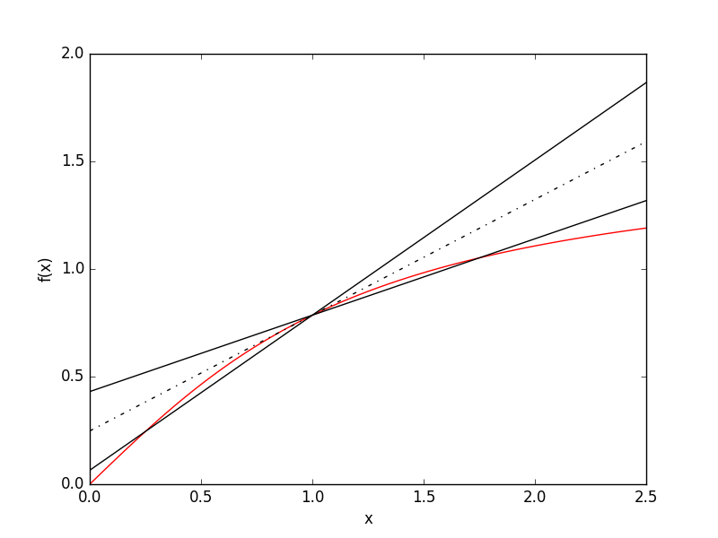

Finite Difference Methods
====================================

In these methods, partial derivatives in partial differential equations are approximated by linear combinations of function values at the grid points. For first order derivatives, the approximation needed can easily be seen from their definition:

$$ \\frac{d f}{d x} = \\lim_{\\Delta x \\to 0} \\frac{f(x+ \\Delta x)-f(x)}{\\Delta x} $$

Hence if we take \\(\\Delta x\\) to be sufficiently small then the derivative will be well approximated by the following equivalent (in the limit of \\(\\Delta x \\to 0 \\)) expressions:

$$ \\frac{d f}{d x} \\approx \\frac{f(x+ \\Delta x)-f(x)}{\\Delta x} $$
$$ \\frac{d f}{d x} \\approx \\frac{f(x)-f(x- \\Delta x)}{\\Delta x} $$
$$ \\frac{d f}{d x} \\approx \\frac{f(x+ \\Delta x)-f(x- \\Delta x)}{2 \\Delta x} $$

If we now create a spatial gird, \\(x_i = x_0 + i \\Delta x \\), then labelling the function, \\(f\\), on these grid points as \\(f_i\\), then the finite differences as defined as:

Forward difference:
$$ \\left( \\frac{d f}{d x} \\right)_i \\approx \\frac{f_{i+1}-f_{i}}{\\Delta x} $$

Backward difference:
$$ \\left( \\frac{d f}{d x} \\right)_i \\approx \\frac{f_{i}-f_{i-1}}{\\Delta x} $$

Central difference:
$$ \\left( \\frac{d f}{d x} \\right)_i \\approx \\frac{f_{i+1}-f_{i-1}}{2 \\Delta x} $$

The errors in these approximations can be found by considering the Taylor expansions of \\(f_{i+1}\\) and \\(f_{i-1}\\):

$$ T_1: f_{i+1} = f_{i} + \\Delta x \\left( \\frac{d f}{d x} \\right)_i + \\frac{\\Delta x^2}{2} \\left( \\frac{d^2 f}{d x^2} \\right)_i + \\mathcal{O} (\\Delta x^3) $$

$$ T_2: f_{i-1} = f_{i} - \\Delta x \\left( \\frac{d f}{d x} \\right)_i + \\frac{\\Delta x^2}{2} \\left( \\frac{d^2 f}{d x^2} \\right)_i - \\mathcal{O} (\\Delta x^3) $$

Hence \\(T_1\\) implies the forward difference has error of order \\(\\Delta x\\) and similarly for \\(T_2\\) and the backward difference. However considering \\(T_1 - T_2\\) we see the central difference has error of order \\(\\Delta x^2 \\). Higer-order approximations can be found by considering linear combinations of Taylor expansions including \\(f_{i+2}\\) and \\(f_{i-2}\\). 

The figure above shows estimates of the gradient of arctan(x) at x = 1 using the forward, backward and central difference methods. The hashed line shows the central difference result while the other lines are the first order forward and backward methods. A \\(\\Delta x = 0.75\\) was used, large to exaggerate the errors in these methods.

For second order derivatives, the approximation can be found via \\(T_1 + T_2\\):

$$ T_1 + T_2: f_{i+1} + f_{i-1} = 2 f_{i} + \\Delta x^2 \\left( \\frac{d^2 f}{d x^2} \\right)_i + \\mathcal{O} (\\Delta x^3) $$

Therefore:
$$ \\left( \\frac{d^2 f}{d x^2} \\right)_i \\approx \\frac{f_{i+1} - 2 f_{i} + f_{i-1}}{ \\Delta x^2} + \\mathcal{O} (\\Delta x) $$

These methods can be combined to evaulate mixed derivatives.

For variable coefficients, e.g. \\(f(x) = d(x) \frac{d u}{d x} \\), we can find the first order derivative using half-step central differences \\( \\left( \\frac{d f}{d x} \\right)_i \\approx \\frac{f_{i+1/2}-f_{i-1/2}}{\\Delta x} \\):

$$ \\left( \\frac{d f}{d x} \\right)_i \\approx \\frac{f_{i+1/2}-f_{i-1/2}}{\\Delta x} = \\frac{d_{i+1/2} \\left( \\frac{d u}{d x} \\right)_{i+1/2} - d_{i-1/2} \\left( \\frac{d u}{d x} \\right)_{i-1/2} }{\\Delta x} $$
$$ = \\frac{d_{i+1/2} u_{i+1} - (d_{i+1/2}+d_{i-1/2}) u_i + d_{i-1/2} u_{i-1}}{\\Delta x^2} $$