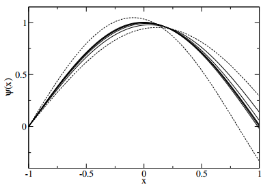

Bisection Search
====================================

We wish to find a function \\(f(E) = 0\\). First we must find values of \\(E\\) which bracket the solution, that is:
$$f(E_1) < 0,  f(E_2) > 0$$
By evaluating \\(f\\) at the midpoint, \\(E_3 = \\frac{1}{2}(E_1+E_2)\\), we can rebracket our solution. Hence the solution will be converge on iteration. Solutions can converge from both above and below \\(0\\), so your search algorithm should account for this.

The search should stop when \\(\\left| \ f(E)\\right| < \\epsilon\\) where \\(\\epsilon\\) is a suitably small number.

Dotted lines show the bracket solutions and the solid lines show the progression of the search to obtain the ground state of the potential.

Argument list
^^^^^^^^^^^

bisection_search(x,dx,V,params,bracket_E,tolerance = 0.5,max_evals = 1000)
   
   Uses the Numerov method to perform a bisection search in energy for a wavefunction which goes to zero at the boundaries

   **Parameters:**

   *x: numpy array*

   An N element numpy array of equally spaced points (creating using numpy linspace is advised) at which the wavefunction will be evaluated

   *dx: float*

   The spacing between points in the x array
   
   *V: function*
   
   Function which takes x as an argument and returns the value of potential at that point, V(x)

   *params: list*
   
   List which can be used within your code to hold various physical parameters. The first element is required to be equal to the particle mass, but apart from this the size of the list and the other parameters are not called

   *bracket_E: list*

   A 2 element list which expresses a range in which the energy eigenvalue(s) lie. For the 2 energy values in this list, one of the values will have the Numerov approximated wavefunction above 0 and the other below 0. The ordering of these is handled by the function.

   *tolerance: float*

   The tolerance of the bisection search i.e. if the absolute value of the wavefunction at the right-hand boundary is less than the tolerance then the search is complete.

   *max_evals: int*

   The number of search evaluations taken before the search is given up. It is more likely your bracket_E list is not wide enough or your tolerance is too low than max_evals is too low
   
   **Returns:**

   The un-normalised wavefunction, as a numpy array, which has satisfied the bisection search (or max_evals has been reached) and the energy eigenvalue estimate as a float
